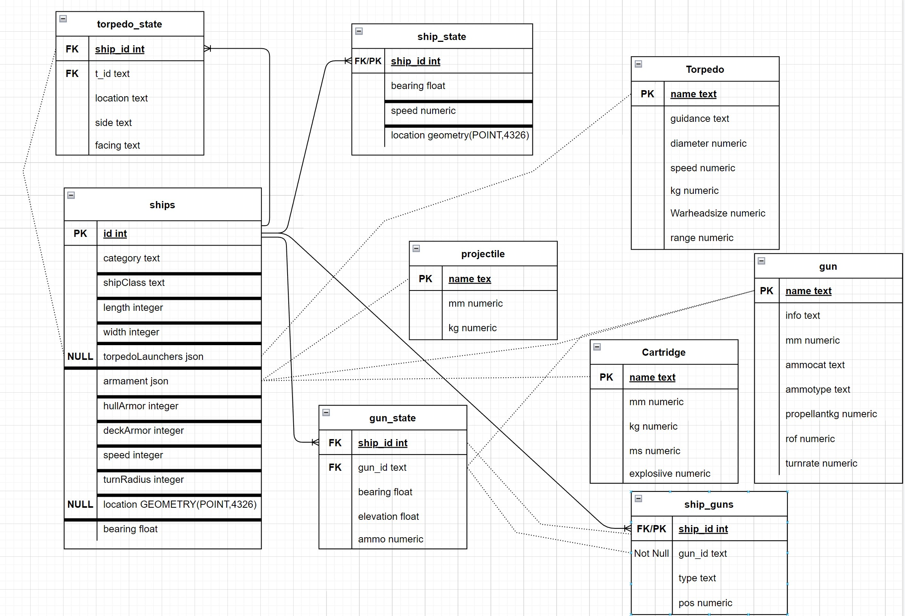

## P04.2 - BS: Database Creation
### Dakota Wilson
### Description:

This project creates all necessary tables for this game as well as setting some basic reusable. Also there is a schema of the database.

### Files

|   #   | File/folder              | Description                                                         |
| :---: | ------------------------ | ------------------------------------------------------------------- |
|   1   | MakeTables.py            | Creates and loads all basic tables                                  |
|   2   | RunQueries.py            | Runs 5 basic queries and outputs the results                        |
|   3   | SQL/MakeTables           | SQL files that are used to create the tables                        |
|   4   | SQL/Queries              | SQL files with all the basic reusable queries                       |
|   5   | Output.txt               | Readable output from the basic queries                              |

### Instructions

- Make sure you install library from `pip install psycopg2`

- Example Command:
    - `python MakeTables.py`
    - `python RunQueries.py`

## schema

